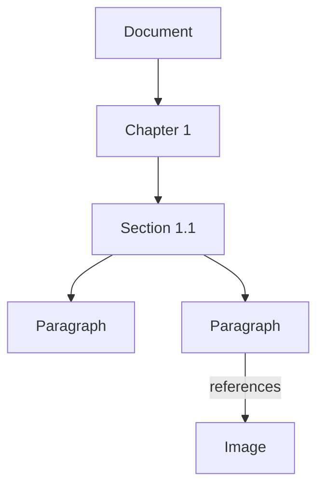

# Topic 6: Semantic Structure — Graph vs. Markdown

**Date:** 2026-05-28
**Participants:** Prajwal, John (PM), Winston (Architect)
**Status:** Resolved
**Session refs:**
- All prior Topics 1-4 session documents
- `_bmad-output/planning-artifacts/sessions/2026-05-28-open-questions-resolution.md`

---

## Problem Statement

The Intermediate Document Model (IDM) is the canonical representation of the parsed document — it holds all extracted text, detected images, artifact classifications, semantic roles, and cross-references. The question: what data structure should the IDM use?

Two candidates were evaluated: **Graph** (node + edge structure, relationship-first) and **Markdown** (linear string with block index, render-first).

---

## Option A: Graph (Mindmap / Tree Structure)

**Concept:** Every atomic unit is a node. Relationships between them are typed edges.



```json
{
  "nodes": [{ "id": "c1", "type": "chapter", "label": "Introduction" }],
  "edges": [{ "from": "d1", "to": "c1", "relation": "contains", "order": 1 }]
}
```

**Pros:**
- Cross-references are first-class (image↔paragraph, table↔section)
- Multiple relationship types (contains, references, placed-before, next-sibling)
- Can represent non-linear structures (marginalia, footnotes, sidebars)
- Easy to add new node/edge types later

**Cons:**
- Linear rendering requires topological sort
- HTML export is complex (traverse graph → emit)
- Debugging needs graph visualization tools
- Storage is more complex

---

## Option B: Markdown String

**Concept:** Linear hierarchical string with a block index pointing into offsets.

```markdown
# Chapter 1: Introduction
## Section 1.1: Background
The process begins with mitosis...
[Image: Cell mitosis stages]
```

```json
{
  "markdown": "# Chapter 1...",
  "blocks": [
    { "type": "heading", "level": 1, "mdOffset": 0 },
    { "type": "image", "altText": "...", "mdOffset": 120 }
  ]
}
```

**Pros:**
- Naturally ordered — render top to bottom
- Directly convertible to HTML (MD → HTML renderer)
- Easy to debug — human-readable plain text
- Simple storage (one string + one block index)
- Familiar to every developer

**Cons:**
- Cross-references have no native representation
- Non-linear structures need hacks
- Lossy — image positions, table data not preserved in string form
- String offsets shift on edit (fragile)

---

## Decision: Hybrid — Graph as Canonical, Markdown as Derived

**Approved architecture:**

```
                  ┌──────────────────┐
                  │   Graph IDM      │
                  │  (canonical)     │
                  │                  │
                  │  Nodes + Edges   │
                  │  Relationships   │
                  │  Cross-refs      │
                  └──────┬───────────┘
                         │
                         ▼
                  ┌──────────────────┐
                  │  Generate        │
                  │  Markdown        │
                  │  (derived view)  │
                  └──────┬───────────┘
                         │
                         ▼
                  ┌──────────────────┐
                  │  HTML Export     │
                  │  (final output)  │
                  └──────────────────┘
```

| Layer | Role | Format | Queryable |
|-------|------|--------|-----------|
| **Graph IDM** | Canonical source of truth | Nodes + typed edges in MongoDB | Yes — graph traversal for relationships |
| **Derived Markdown** | Materialized linear view for export | Markdown string + block index | Limited — regex on string |
| **HTML** | Final output | Self-contained HTML5 | N/A — final product |

**Key rule:** The graph drives everything. Markdown is regenerated from the graph whenever needed — never edited directly. This keeps the canonical data pure.

---

## Graph Node Types

```typescript
type NodeType =
  | 'document'
  | 'chapter'
  | 'section'
  | 'subsection'
  | 'paragraph'
  | 'heading'
  | 'image'
  | 'table'
  | 'caption'
  | 'sidebar'
  | 'footnote'
  | 'list'
  | 'list-item'
  | 'blockquote'
  | 'code-block'
  | 'page-break'
  | 'artifact'        // classified non-content (keep for traceability)
  | 'unknown'
```

## Graph Edge Types

```typescript
type EdgeType =
  | 'contains'          // parent → child hierarchy
  | 'next-sibling'      // reading order within same parent
  | 'references'        // text → image/table it references
  | 'referenced-by'     // image/table → text that references it
  | 'placed-before'     // image placed before paragraph
  | 'placed-after'      // image placed after paragraph
  | 'inline-interrupted'// image found mid-paragraph (resolved to after)
  | 'footnote-to'       // footnote marker → footnote content
  | 'continues-on-page' // element spans across page break
  | 'side-note'         // sidebar text → main body text it annotates
```

### Edge Properties

```typescript
interface Edge {
  from: string           // node ID
  to: string             // node ID
  relation: EdgeType
  order: number          // sorting order within parent (for 'contains')
  confidence: number     // 0.0-1.0 (especially for AI-detected edges)
  rationale?: string     // why this edge was created
  source: 'pdf-bookmark' | 'toc-parse' | 'ai-analysis' | 'spatial' | 'vision'
}
```

---

## Storage in MongoDB

```
Collection: extractions
  {
    _id: ObjectId,
    documentId: ObjectId,
    graph: {
      nodes: Node[],
      edges: Edge[],
      rootNodeId: string   // document node
    },
    derivedMarkdown: string,
    pageCount: number,
    pipelineVersion: string,
    createdAt: Date
  }
```

- The entire graph for one extraction fits in a MongoDB document (embeddable)
- Querying: can use MongoDB aggregation for graph traversals, or load the full graph into memory (typical document = tens of thousands of nodes — fits in RAM)
- Future: if graph queries become bottleneck, can add Neo4j or RedisGraph as dedicated graph store (abstraction layer)

---

## Export Path

```
Graph IDM
    │
    ├── Traverse DFS in reading order (respecting 'contains' + 'next-sibling')
    │
    ├── For each node:
    │     - heading → "# " + text
    │     - paragraph → text + "\n\n"
    │     - image → "[Image: alt-text]" with placement edge info
    │     - table → rendered as markdown table or prose summary
    │     - chapter → "# " (or "## " for sections)
    │
    ├── Result: Markdown string
    │
    └── Markdown → HTML via standard MD renderer
          (remark, marked, or showdown)
          + custom plugin for alt-text label placement
```

---

## Open Items

1. **Graph storage abstraction** — MongoDB embedded is fine for v1, but define the abstraction boundary now so swapping to Neo4j later doesn't require rewrite.
2. **DFS traversal algorithm** — need to define ordering rules: edges with same parent sorted by `order`, depth-first, handle cross-references (visited node already rendered? skip or link?).
3. **Markdown generation fidelity** — some node types may not map cleanly to markdown (sidebars, footnotes, interleaved columns). Define fallback behavior.
